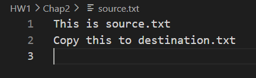
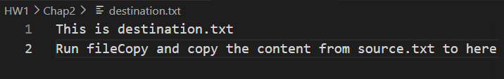
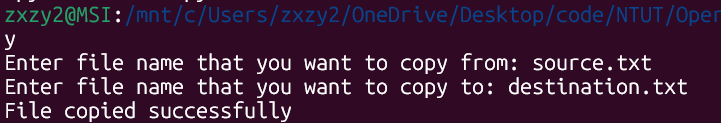
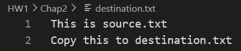
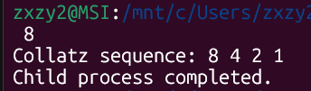

# OSHW#1_individual_112590019

## Files

### 1. Chap2 2.24: 
fileCopy.c -> Program <br>
source.txt -> The file that is going to be copied from (Can input any text you like) <br>
destination.txt -> The file that is going to be copied to

### 2. Chap3 3.21:
collatz.c -> Program

## Build

### Chap2 2.24:
```bash
gcc fileCopy.c -o fileCopy
```

### Chap3 3.21:
```bash
gcc collatz.c -o collatz
```

## Run the program

### Chap2 2.24:
```bash
./fileCopy
```

### Chap3 3.21:
```bash
./collaz any_number_you_like
```

## Execution Snapshots
### source.txt


### destination.txt


### fileCopy


### destination.txt after fileCopy


### collatz with number 8
