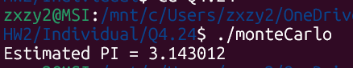
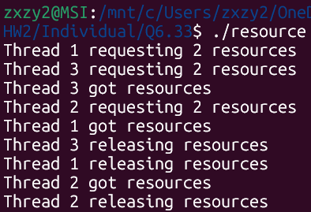

# OSHW#1_individual_112590019

## Files

### 1. Chap4 4.24: 
monteCarlo.c -> Program <br>

### 2. Chap6 6.33:
resource.c -> Program

## Build

### Chap4 4.24:
```bash
gcc monteCarlo.c -o monteCarlo -lpthread
```

### Chap6 6.33:
```bash
gcc resource.c -o resource -lpthread
```

## Run the program

### Chap4 4.24:
```bash
./monteCarlo
```

### Chap6 6.33:
```bash
./resource
```

## Execution Snapshots
- Chapter 4 Q4.24:


- Chapter 6 Q6.33:
