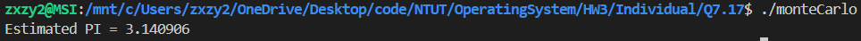
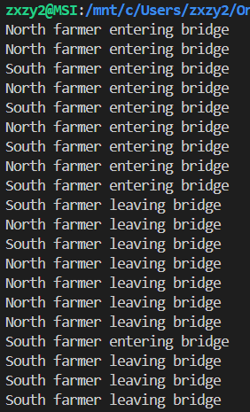
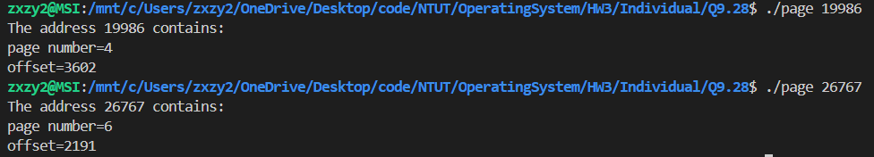

# OSHW#1_individual_112590019

## Files

### 1. Chap7 7.17: 
monteCarlo.c -> Program <br>

### 2. Chap8 8.32:
bridge.c -> Program

### 3. Chap9 9.28:
page.c -> Program

## Build

### Chap7 7.17:
```bash
gcc monteCarlo.c -o monteCarlo -lpthread
```

### Chap8 8.32:
```bash
gcc bridge.c -o bridge -lpthread
```

### Chap9 9.28:
```bash
gcc page.c -o page
```

## Run the program

### Chap7 7.17:
```bash
./monteCarlo
```

### Chap8 8.32:
```bash
./bridge
```

### Chap9 9.28:
```bash
./page (virtual address)
```

## Execution Snapshots
- Chapter 7 Q7.17: <br>


- Chapter 8 Q8.32: <br>


- Chapter 9 Q9.28: <br>
